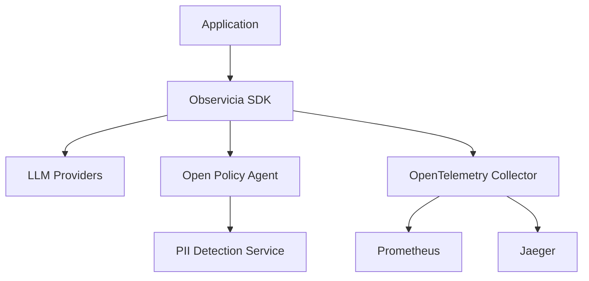

# Observicia SDK

Observicia is a Cloud Native observability and policy control SDK for LLM applications. It provides seamless integration with CNCF native observability stack while offering comprehensive token tracking, policy enforcement, and PII protection capabilities.

[](LICENSE)
[](https://opentelemetry.io/)
[](https://www.openpolicyagent.org/)

## Features

- **Comprehensive Token Tracking**
  - Real-time token usage monitoring
  - Provider-specific accounting
  - Usage trend analysis

- **Cloud Native Policy Enforcement**
  - PII detection and protection
  - Custom policy definition support

- **Cloud Native Observability**
  - OpenTelemetry integration
  - Jaeger distributed tracing
  - Custom monitoring dashboards

- **Multi-Provider Support**
  - OpenAI
  - Anthropic
  - LiteLLM
  - WatsonX

## Architecture

Observicia SDK integrates with your OpenShift environment using native components:



## Deployment

### Prerequisites

- Kubernetes/OpenShift cluster
- OpenTelemetry Collector
- Open Policy Agent
- Prometheus (optional)
- Jaeger (optional)


### Configuration

The SDK is configured through an external YAML file specified by the `OBSERVICIA_CONFIG_FILE` environment variable. 

#### Steps to Configure

1. Create a YAML configuration file (e.g., `observicia_config.yaml`) with the desired settings:

```yaml
service_name: patient-rag-app
otel_endpoint: null
opa_endpoint: http://opa-server:8181/
policies:
  - name: pii_check
    path: policies/pii
    description: Check for PII in responses
    required_trace_level: enhanced
    risk_level: high
  - name: prompt_compliance
    path: policies/prompt_compliance
    description: Check for prompt compliance
    required_trace_level: basic
    risk_level: medium
log_file: null
trace_console: false
```

2. Set the `OBSERVICIA_CONFIG_FILE` environment variable to the path of the configuration file:

```bash
export OBSERVICIA_CONFIG_FILE=/path/to/observicia_config.yaml
```

3. Initialize the SDK in your code without specifying additional parameters:

```python
from observicia import init

# Initialize Observicia
init()
```

See example usages in the [examples](examples) directory.

## Policy Definition

Define custom policies using OPA's Rego language


Trace spans include:
- Token usage per request
- Policy evaluation results
- Error information
- Request/response content


## License

This project is licensed under the Apache License 2.0 - see the [LICENSE](LICENSE) file for details.
