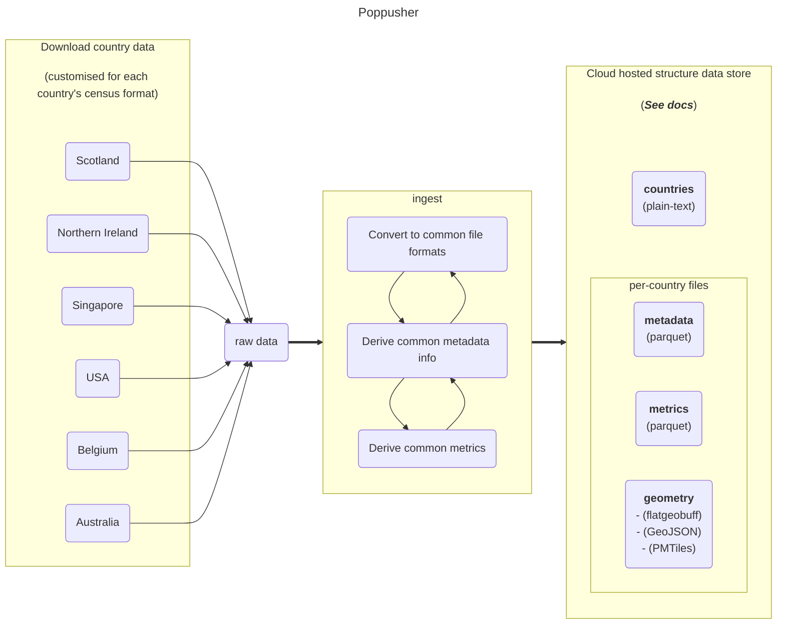
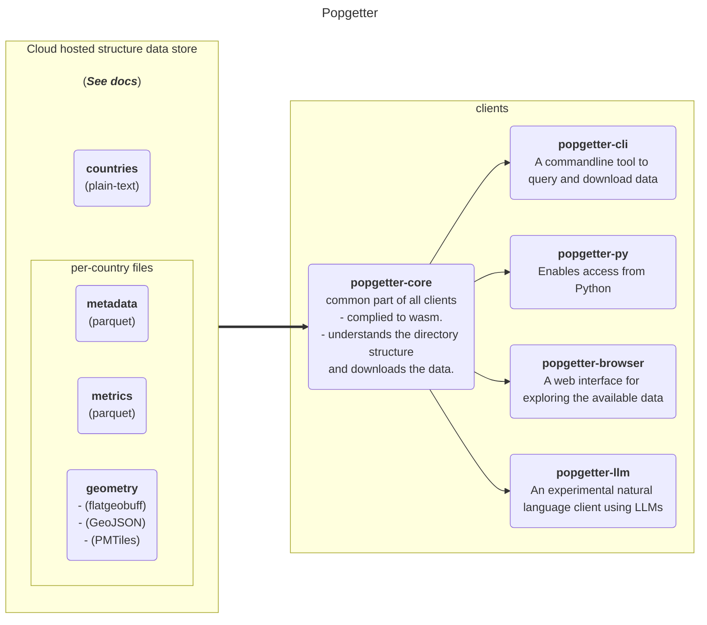

# Data flow diagram

The diagrams below show the flow of data through the system. The main purpose is
highlight the distinction between the data preparation pipeline (`poppusher`)
and the data access components (`popgetter-*`).

